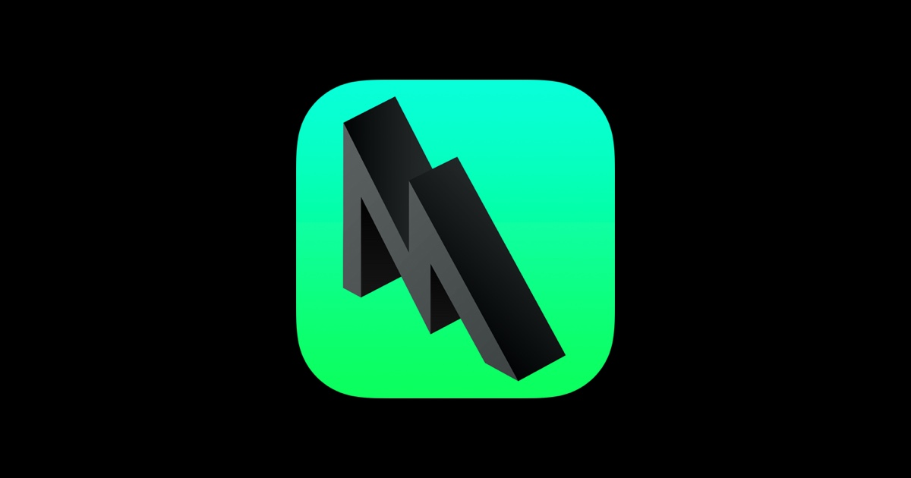

 
#  Hello, Metal!

In this repository year to publish all the various projects and examples that I will use to learn Metal.
It's a personal journey of discovery of the framework, it's very probable I'll make a lot of mistakes along the way, but that's okay 😅👾🎮♥️

### About

    
    
    
    
    
    
    

**Editors**: 

* [Gianluca Orpello](https://github.com/gorpello)

### Project List:

1. **[Hello, Metal!](https://pages.github.com/)**
